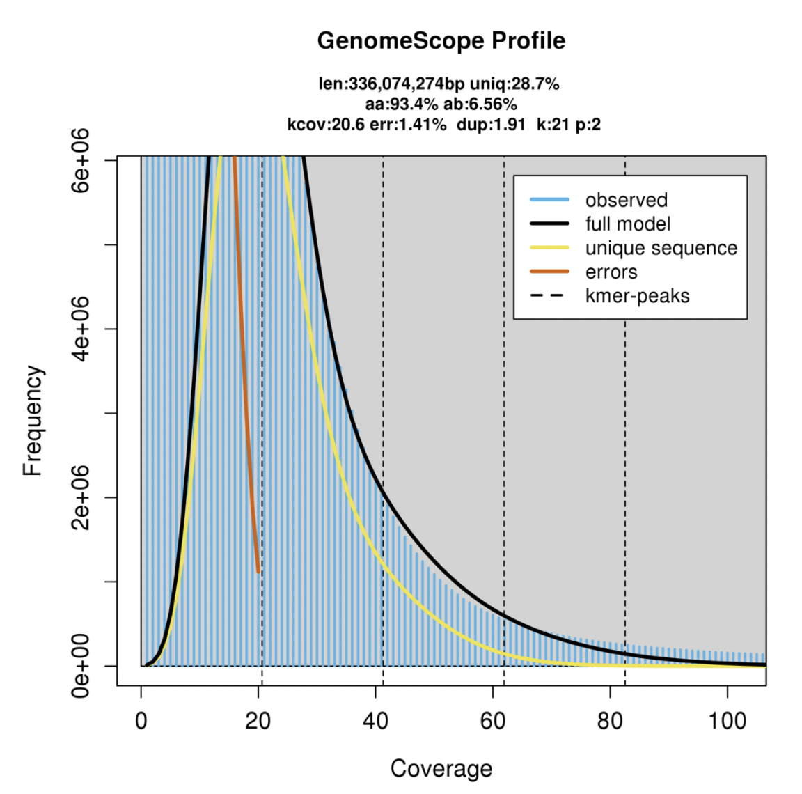
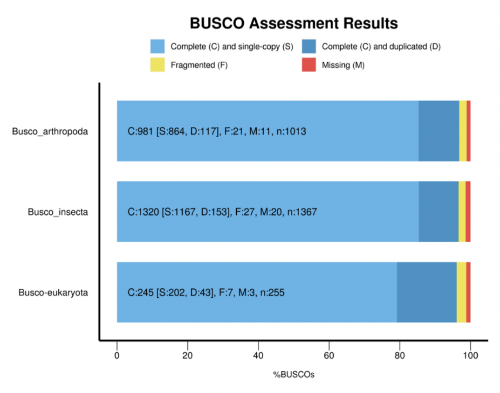
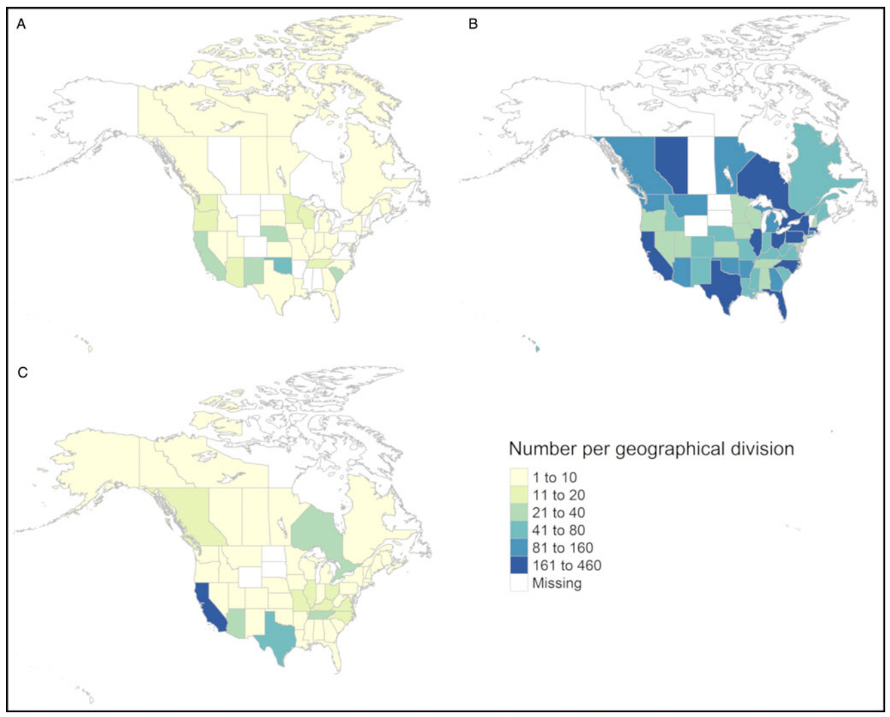
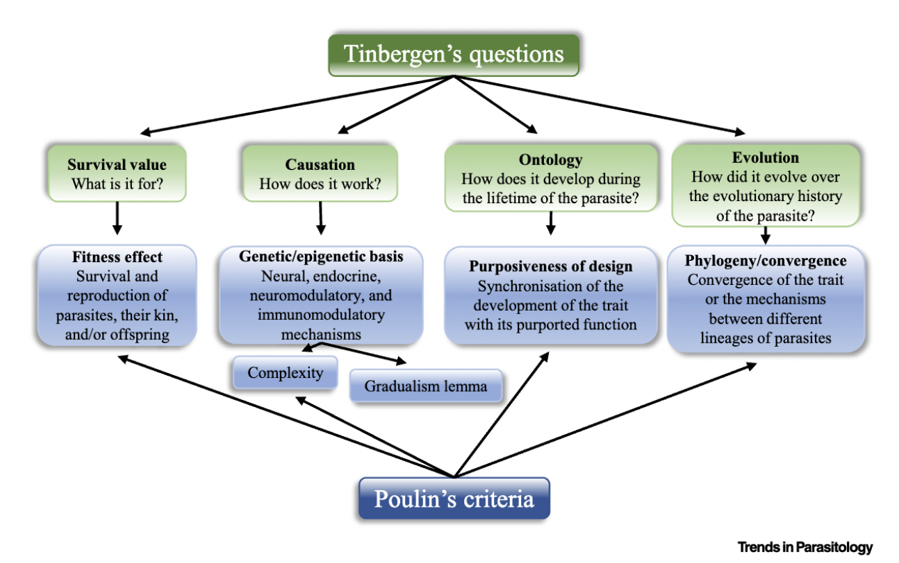
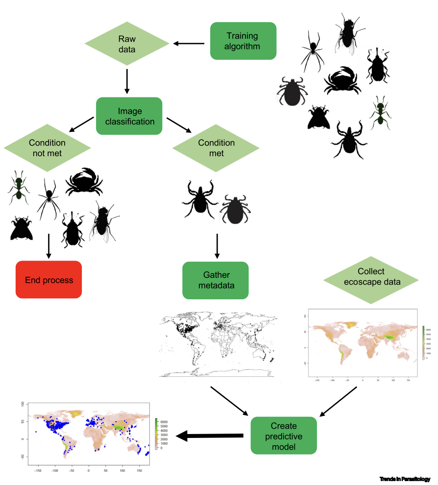
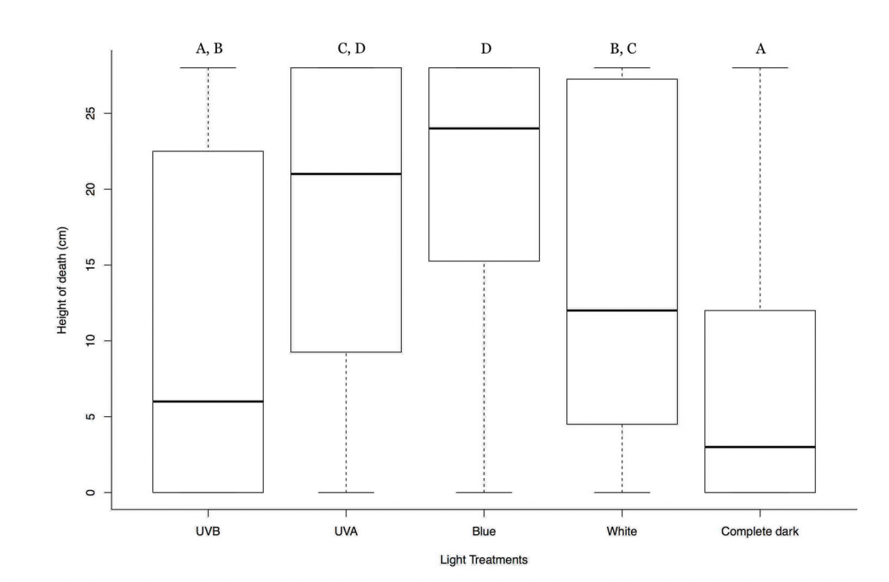
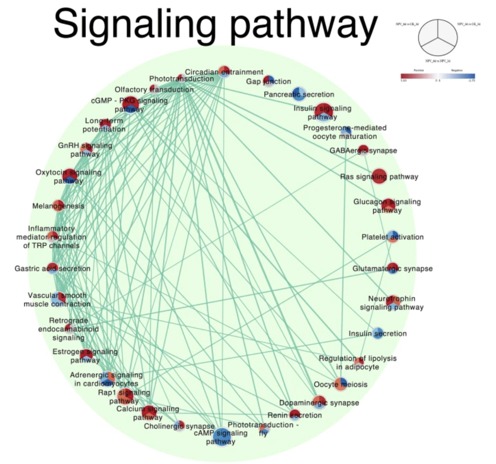

<h2 id="publications" style="margin: 2px 0px -15px;">Publications</h2>

<ol class="bibliography">

<li>

  

    
    <abbr class="badge">2023</abbr>
  

  

    
<a href="https://onlinelibrary.wiley.com/doi/full/10.1111/1755-0998.13763">The proof is in the poo: Non‐invasive method to detect endoparasitic infection</a>

    
 Jean‐François Doherty*, <strong>Upendra R Bhattarai*</strong>, Sara Ferreira, Robert Poulin, Neil J Gemmell, Eddy J Dowle

    
*equally contributing authors

    
<em> Molecular Ecology Resources <strong>2023;00:1-12.</strong></em>

    

      <a href="https://onlinelibrary.wiley.com/doi/pdfdirect/10.1111/1755-0998.13763" class="btn btn-sm z-depth-0" role="button" target="_blank" style="font-size:12px;">PDF</a>
    

  

</li>

<li>

  

    
    <abbr class="badge">2022</abbr>
  

  

    
<a href="https://academic.oup.com/g3journal/article/12/10/jkac199/6668290">Genome assembly and annotation of the European earwig Forficula auricularia (subspecies B)</a>

    
 <strong>Upendra R Bhattarai</strong>, Mandira Katuwal, Robert Poulin, Neil J Gemmell, Eddy J Dowle

    
<em> G3 Genes|Genomes|Genetics <strong>2022;12(10):jkac199.</strong></em>

    

      <a href="assets/files/publications/jkac199.pdf" class="btn btn-sm z-depth-0" role="button" target="_blank" style="font-size:12px;">PDF</a>
    

  

</li>
 
<li>

  

    
    <abbr class="badge">2022</abbr>
  

  

    
<a href="https://www.biorxiv.org/content/10.1101/2022.11.05.515230v1.full">Genome assembly and annotation of the mermithid nematode Mermis nigrescens</a>

    
 <strong>Upendra R Bhattarai</strong>, Robert Poulin, Neil J Gemmell, Eddy Dowle

    
<em> bioRxiv <strong>2022.11.05.515230.</strong></em>

    

      <a href="assets/files/publications/2022.11.05.515230v1.full.pdf" class="btn btn-sm z-depth-0" role="button" target="_blank" style="font-size:12px;">PDF</a>
    

  

</li>

<li>

  

    
    <abbr class="badge">2022</abbr>
  

  

    
<a href="https://www.biorxiv.org/content/10.1101/2022.08.01.502324v1.full">Whole genome assembly and annotation of the lucerne weevil Sitona discoideus</a>

    
 Mandira Katuwal, <strong>Upendra R Bhattarai</strong>, Craig B. Phillips, Neil J Gemmell, Eddy Dowle

    
<em> bioRxiv <strong>2022.08.01.502324.</strong></em>

    

      <a href="assets/files/publications/2022.08.01.502324v1.full.pdf" class="btn btn-sm z-depth-0" role="button" target="_blank" style="font-size:12px;">PDF</a>
    

  

</li>

<li>

  

    
    <abbr class="badge">2021</abbr>
  

  

    
<a href="https://www.biorxiv.org/content/10.1101/2022.08.01.502324v1.full">The people vs science: can passively crowdsourced internet data shed light on host–parasite interactions?</a>

    
 Jean-François Doherty, Antoine Filion, Jerusha Bennett, <strong>Upendra Raj Bhattarai</strong> et. al.

    
<em> bioRxiv <strong>2022.08.01.502324.</strong></em>

    

      <a href="https://www.otago.ac.nz/parasitegroup/PDF%20papers/Dohertyetal2021-Para.pdf" class="btn btn-sm z-depth-0" role="button" target="_blank" style="font-size:12px;">PDF</a>
    

  

</li>
 
<li>

  

    
    <abbr class="badge">2021</abbr>
  

  

    
<a href="https://www.sciencedirect.com/science/article/abs/pii/S147149222100009X">The adaptiveness of host behavioural manipulation assessed using Tinbergen’s four questions</a>

    
 <strong>Upendra R. Bhattarai#</strong>, Jean-François Doherty, Eddy Dowle, Neil J. Gemmell

    
 # Corresponding author

    
<em> Trends in Parasitology <strong>2021.37(7):597-609.</strong></em>

    

      <a href="assets/files/publications/2021-TheadaptivenessofhostbehaviouralmanipulationassessedusingTinbergensfourquestions (1).pdf" class="btn btn-sm z-depth-0" role="button" target="_blank" style="font-size:12px;">PDF</a>
    

  

</li>
  
<li>

  

    
    <abbr class="badge">2021</abbr>
  

  

    
<a href="https://www.sciencedirect.com/science/article/abs/pii/S147149222100009X">iParasitology: mining the internet to test parasitological hypotheses</a>

    
 Robert Poulin, Jerusha Bennett, Antoine Filion,<strong>Upendra R. Bhattarai</strong>, et. al.

    
 # Corresponding author

    
<em> Trends in Parasitology <strong>2021.37(4):267-272.</strong></em>

    

      <a href="https://www.otago.ac.nz/parasitegroup/PDF%20papers/Poulinetal2021-TP.pdf" class="btn btn-sm z-depth-0" role="button" target="_blank" style="font-size:12px;">PDF</a>
    

  

</li>
  
<li>

  

    
    <abbr class="badge">2018</abbr>
  

  

    
<a href="https://www.sciencedirect.com/science/article/abs/pii/S147149222100009X">Effect of Different Light Spectrum in Helicoverpa armigera Larvae during HearNPV Induced Tree-Top Disease</a>

    
 Mandira Katuwal Bhattarai, <strong>Upendra Raj Bhattarai</strong>, Ji-nian Feng, Dun Wang

    
<em> Insects <strong>2018.9(4):183.</strong></em>

    

      <a href="assets/files/publications/insects-09-00183.pdf" class="btn btn-sm z-depth-0" role="button" target="_blank" style="font-size:12px;">PDF</a>
    

  

</li>  
  
  
<li>

  

    
    <abbr class="badge">2018</abbr>
  

  

    
<a href="https://www.nature.com/articles/s41598-018-35885-4">Phototransduction and circadian entrainment are the key pathways in the signaling mechanism for the baculovirus induced tree-top disease in the lepidopteran larvae</a>

    
 <strong>Upendra Raj Bhattarai</strong>, Fengjiao Li, Mandira Katuwal Bhattarai, Abolfazl Masoudi, Dun Wang

    
<em> Scientific Reports <strong>2018.8,17528.</strong></em>

    

      <a href="assets/files/publications/s41598-018-35885-4.pdf" class="btn btn-sm z-depth-0" role="button" target="_blank" style="font-size:12px;">PDF</a>
    

  

</li> 
  
<li>

  

    
    <abbr class="badge">2018</abbr>
  

  

    
<a href="https://link.springer.com/article/10.1007/s12250-018-0046-x">Insights into the Temporal Gene Expression Pattern in Lymantria dispar Larvae During the Baculovirus Induced Hyperactive Stage</a>

    
 <strong>Upendra Raj Bhattarai</strong>, Mandira Katuwal Bhattarai, Fengjiao Li, Dun Wang

    
<em> Virologica Sinica <strong>2018.33:345-358.</strong></em>

    

      <a href="assets/files/publications/s12250-018-0046-x.pdf" class="btn btn-sm z-depth-0" role="button" target="_blank" style="font-size:12px;">PDF</a>
    

  

</li> 
  
<li>

  

    
    <abbr class="badge">2018</abbr>
  

  

    
<a href="https://link.springer.com/article/10.1007/s00253-017-8651-4">Elevational distribution and morphological attributes of the entomopathogenic fungi from forests of the Qinling Mountains in China</a>

    
 Abolfazl Masoudi, John Lad Koprowski, <strong>Upendra Raj Bhattarai</strong>, Dun Wang

    
<em> Applied microbiology and biotechnology <strong>2018.102:1483-1499.</strong></em>

    

      <a href="https://ag.arizona.edu/research/redsquirrel/res_pdf/Masoudi_etal_AppMicroBiotech_EntomopathogenicFungiQinlingMtnsChina_Preprint%2017.pdf" class="btn btn-sm z-depth-0" role="button" target="_blank" style="font-size:12px;">PDF</a>
    

  

</li> 
  
  
<li>

  

    
    <abbr class="badge">2018</abbr>
  

  

    
<a href="https://www.cabdirect.org/cabdirect/abstract/20183180551">Pathogenicity and virulence of the entomopathogenic fungi depend on selective suppression of anti-oxidative and detoxification enzymes in Tenebrio molitor (Coleoptera: Tenebrionidae) larvae.</a>

    
 Mandira Katuwal Bhattarai, <strong>Upendra Raj Bhattarai</strong>,  Abolfazl Masoudi, JiNian Feng, Dun Wang

    
<em> Biochemical and Cellular Archives <strong>2018.18(1):861-874.</strong></em>

    

      <a href="assets/files/publications/Mandiraetal2018.pdf" class="btn btn-sm z-depth-0" role="button" target="_blank" style="font-size:12px;">PDF</a>
    

  

</li>

<li>

  

    
    <abbr class="badge">2015</abbr>
  

  

    
<a href="https://www.sciencedirect.com/science/article/pii/S0022201115000713">Fatal attraction: male spider mites prefer females killed by the mite-pathogenic fungus Neozygites floridana.</a>

    
Nina Trandem, <strong>Upendra Raj Bhattarai</strong>, Karin Westrum, Geir Kjølberg Knudsen, Ingeborg Klingen

    
<em> Journal of invertebrate pathology <strong>2015.128:6-13.</strong></em>

    

      <a href="assets/files/publications/1-s2.0-S0022201115000713-main.pdf" class="btn btn-sm z-depth-0" role="button" target="_blank" style="font-size:12px;">PDF</a>
    

  

</li>

 

</ol>

